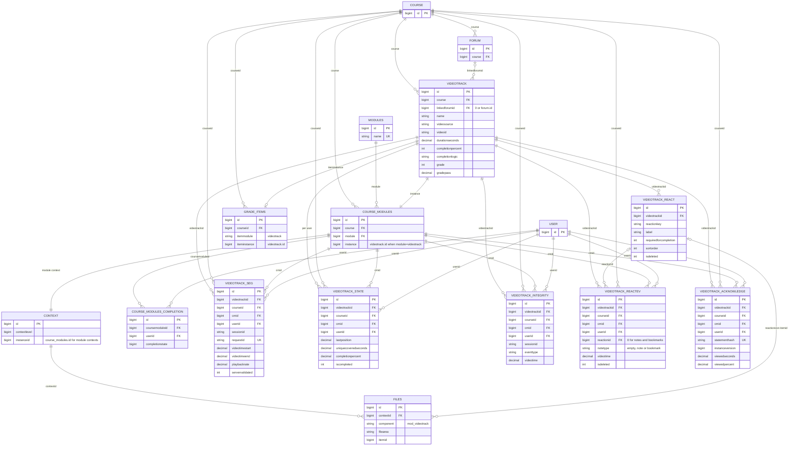

# VideoTrack — schema database ed Entity–Relationship

- **Baseline analizzata:** VideoTrack 1.7.115 / 2026082704
- **Schema XMLDB:** `db/install.xml`, versione `2026082301`
- **Data del documento:** 2026-08-27
- **Compatibilità dichiarata:** Moodle 5.0–5.3

File complementari: [sorgente Mermaid](VIDEOTRACK_DB_ER_SCHEMA.mmd) ·
[diagramma SVG](VIDEOTRACK_DB_ER_SCHEMA.svg)

Lo schema è invariato rispetto alla 1.7.112. La 1.7.115 corregge soltanto il
selettore di presentazione dei requisiti di completamento tra le versioni
Moodle, i relativi contratti di test e la documentazione distribuita; non
contiene migrazioni database.

## Avvertenza sulle relazioni

`db/install.xml` dichiara sette tabelle VideoTrack, le relative chiavi primarie
e gli indici, ma **non dichiara foreign key fisiche**. Nel diagramma `FK`
identifica quindi una relazione logica verificata nel runtime, nelle query,
nella Privacy API o nel backup/restore. Questa distinzione evita di attribuire
al database vincoli referenziali che Moodle non installa realmente.

## Diagramma ER Mermaid

## Mappa delle integrazioni con Moodle core

| Origine | Destinazione core | Natura | Evidenza applicativa principale |
|---|---|---|---|
| `videotrack.course` e `*.courseid` | `course.id` | riferimento logico persistito | `db/install.xml`, query di report/analytics |
| `course_modules.instance` | `videotrack.id` | collegamento standard delle attività Moodle, filtrato dal modulo `videotrack` | `lib.php`, query con `course_modules` |
| `*.cmid` | `course_modules.id` | riferimento logico persistito | servizi external, Privacy API, analytics |
| `*.userid` | `user.id` | riferimento logico persistito | tracker, report, Privacy API |
| `videotrack.linkedforumid` | `forum.id` | forum di destinazione opzionale | `classes/local/forum_bridge.php`; annotazione backup `forum` |
| `context.instanceid` | `course_modules.id` | contesto `CONTEXT_MODULE` | `context_module::instance($cmid)` |
| `files.contextid` | `context.id` | file Moodle del componente `mod_videotrack` | filearea `videocontent`, `posterimage`, `subtitles`, `transcripts`, `chapters`, `reactionicon`, `intro` |
| `grade_items.iteminstance` | `videotrack.id` | item gradebook con `itemmodule = videotrack` | `videotrack_grade_item_update()` in `lib.php` |
| `course_modules_completion.coursemoduleid` | `course_modules.id` | stato di completion gestito dal core | Completion API e `classes/completion/custom_completion.php` |
| `videotrack_reactev.reactionid` | `videotrack_react.id` | relazione opzionale; valore `0` per note e bookmark | tracker/reaction runtime |

## Cardinalità essenziali

- un corso contiene zero o più attività VideoTrack;
- una istanza VideoTrack corrisponde a un course module Moodle;
- una istanza può avere molti segmenti, eventi di integrità, reazioni
  configurate, eventi personali e prese visione;
- `videotrack_state` mantiene al massimo una riga per coppia
  `(videotrackid, userid)`;
- una reazione configurata può essere richiamata da molti eventi, mentre note e
  bookmark condividono `videotrack_reactev` con `reactionid = 0`;
- segmenti, stato, integrità, eventi e prese visione replicano `courseid`,
  `cmid` e `userid` per query, privacy e retention, senza FK fisiche.

## Dizionario completo delle tabelle VideoTrack

### `videotrack`

Main table for videotrack instances

| Campo | Tipo XMLDB | Vincoli/default | Relazione o significato |
|---|---|---|---|
| `id` | `int(10)` | NOT NULL; AUTO | Chiave primaria |
| `course` | `int(10)` | NOT NULL; default `0` | `course.id` (logica) |
| `name` | `char(255)` | NOT NULL |  |
| `intro` | `text` | NULL |  |
| `introformat` | `int(4)` | NOT NULL; default `0` |  |
| `youtubeurl` | `text` | NULL |  |
| `videoid` | `char(32)` | NULL; default `` |  |
| `videosource` | `char(20)` | NOT NULL; default `youtube` | youtube \| vimeo \| upload |
| `videourl` | `text` | NULL | Vimeo URL or upload filename reference |
| `playbackspeeds` | `char(100)` | NULL; default `` | Comma-separated allowed speeds; empty = site default |
| `autoplay` | `int(1)` | NOT NULL; default `0` | Start video automatically |
| `loopenabled` | `int(1)` | NOT NULL; default `0` | Loop video when ended |
| `startmuted` | `int(1)` | NOT NULL; default `0` | Start video muted |
| `allowdownload` | `int(1)` | NOT NULL; default `0` | Show download control (upload source only) |
| `html5controls` | `char(255)` | NULL; default `` | Comma-separated list of HTML5 player controls; empty = site default |
| `playerwidth` | `int(5)` | NOT NULL; default `0` | Max player width in px; 0 = use site default |
| `rewindstep` | `int(3)` | NOT NULL; default `0` | Rewind seconds per click; 0 = use site default |
| `fastforwardstep` | `int(3)` | NOT NULL; default `0` | Fast-forward seconds per click; 0 = use site default |
| `captions` | `int(1)` | NOT NULL; default `0` | Enable captions/subtitles |
| `captionslang` | `char(10)` | NULL; default `` | Default caption language code (e.g. it, en) |
| `durationseconds` | `number(10,3)` | NOT NULL; default `0.000` |  |
| `showcontrols` | `int(1)` | NOT NULL; default `1` |  |
| `disablekeyboard` | `int(1)` | NOT NULL; default `0` |  |
| `showfullscreen` | `int(1)` | NOT NULL; default `1` |  |
| `allowseekforward` | `int(1)` | NOT NULL; default `1` |  |
| `allowseekbackward` | `int(1)` | NOT NULL; default `1` |  |
| `allowplaybackratechange` | `int(1)` | NOT NULL; default `1` |  |
| `resumeplayback` | `int(1)` | NOT NULL; default `0` | Resume playback from last saved position |
| `maxplaybackrate` | `int(4)` | NOT NULL; default `0` | Max playback rate in centesimal (0=no limit, 150=1.5x, 200=2x) |
| `blockedseekplaybackrate` | `int(4)` | NOT NULL; default `50` | Playback rate after blocked forward seek in centesimal (50=0.5x, 100=1x) |
| `showtranscript` | `int(1)` | NOT NULL; default `0` | Show the interactive VTT transcript panel for supported video sources |
| `showchapters` | `int(1)` | NOT NULL; default `0` | Show the VTT-based chapter navigation bar for supported video sources |
| `studentnotesenabled` | `int(1)` | NOT NULL; default `0` | Allow students to write personal timestamped notes while watching |
| `bookmarksenabled` | `int(1)` | NOT NULL; default `0` | Allow students to save private named bookmarks at watched timestamps |
| `integrityindicatorsenabled` | `int(1)` | NOT NULL; default `0` | Record privacy-safe diagnostic integrity signals |
| `pauseonfocusloss` | `int(1)` | NOT NULL; default `0` | Pause when the page is hidden; window-focus behaviour follows the site accessibility policy |
| `preventpictureinpicture` | `int(1)` | NOT NULL; default `0` | Best-effort prevention of Picture-in-Picture playback |
| `randomfocuspauses` | `int(1)` | NOT NULL; default `0` | Pause playback after a random active interval to prompt learner attention |
| `acknowledgementenabled` | `int(1)` | NOT NULL; default `0` | Require an explicit learner acknowledgement for the configured statement |
| `acknowledgementtext` | `text` | NULL | Teacher-authored acknowledgement statement |
| `acknowledgementformat` | `int(4)` | NOT NULL; default `1` | Text format for acknowledgement statement |
| `acknowledgementtiming` | `int(1)` | NOT NULL; default `0` | 0=confirmation at any time; 1=confirmation only after the final video second |
| `completionacknowledgement` | `int(1)` | NOT NULL; default `0` | Use current acknowledgement as a custom completion condition |
| `forumpostingenabled` | `int(1)` | NOT NULL; default `0` | Allow students to compose a forum discussion from the current video time |
| `linkedforumid` | `int(10)` | NOT NULL; default `0` | `forum.id`; `0` = nessun forum |
| `forumsubjecttemplate` | `text` | NULL | Forum discussion subject template with {timestamp} and {activity} placeholders |
| `csvdelimiter` | `char(20)` | NOT NULL; default `inherit` | CSV delimiter override: inherit, comma, semicolon, section, hash or pipe |
| `csvexportfields` | `text` | NULL | Comma-separated optional context and identity fields included in CSV exports |
| `countbyvideotime` | `int(1)` | NOT NULL; default `1` |  |
| `completionpercent` | `int(3)` | NOT NULL; default `0` |  |
| `reactionsenabled` | `int(1)` | NOT NULL; default `0` |  |
| `reactionsrequired` | `int(1)` | NOT NULL; default `0` |  |
| `minreactions` | `int(10)` | NOT NULL; default `0` |  |
| `requireallreactiontypes` | `int(1)` | NOT NULL; default `0` |  |
| `completionlogic` | `char(10)` | NOT NULL; default `and` |  |
| `clusterwindow` | `int(3)` | NOT NULL; default `30` |  |
| `showstudentreport` | `int(1)` | NOT NULL; default `1` |  |
| `showreactionnotice` | `int(1)` | NOT NULL; default `1` |  |
| `reactionnoticeformat` | `int(4)` | NOT NULL; default `1` |  |
| `reactionnotice` | `text` | NULL |  |
| `grade` | `int(10)` | NOT NULL; default `0` | 0=no grade, >0=max points, <0=scale id (negative) |
| `gradepass` | `number(10,5)` | NOT NULL; default `0.00000` | Minimum grade to pass (gradepass in gradebook) |
| `showgradeto` | `int(1)` | NOT NULL; default `0` | 1=show grade to student in view.php |
| `timemodified` | `int(10)` | NOT NULL; default `0` |  |
| `timecreated` | `int(10)` | NOT NULL; default `0` |  |

**Indici**

| Nome | Unico | Campi |
|---|---:|---|
| `course_idx` | no | `course` |
| `videoid_idx` | no | `videoid` |

### `videotrack_seg`

Playback requests and server-validated watched segments

| Campo | Tipo XMLDB | Vincoli/default | Relazione o significato |
|---|---|---|---|
| `id` | `int(10)` | NOT NULL; AUTO | Chiave primaria |
| `videotrackid` | `int(10)` | NOT NULL; default `0` | `videotrack.id` (logica) |
| `courseid` | `int(10)` | NOT NULL; default `0` | `course.id` (logica) |
| `cmid` | `int(10)` | NOT NULL; default `0` | `course_modules.id` (logica) |
| `userid` | `int(10)` | NOT NULL; default `0` | `user.id` (logica) |
| `videoid` | `char(32)` | NOT NULL |  |
| `sessionid` | `char(64)` | NOT NULL |  |
| `requestid` | `char(64)` | NOT NULL | Idempotency identifier generated once per browser request |
| `wallclockstart` | `int(10)` | NOT NULL; default `0` |  |
| `wallclockend` | `int(10)` | NOT NULL; default `0` |  |
| `videotimestart` | `number(10,3)` | NOT NULL; default `0.000` |  |
| `videotimeend` | `number(10,3)` | NOT NULL; default `0.000` |  |
| `playbackrate` | `number(6,3)` | NOT NULL; default `1.000` |  |
| `endreason` | `char(32)` | NOT NULL; default `unknown` |  |
| `servervalidated` | `int(1)` | NOT NULL; default `0` | Whether the segment passed the server-authoritative playback guard |
| `timecreated` | `int(10)` | NOT NULL; default `0` |  |

**Indici**

| Nome | Unico | Campi |
|---|---:|---|
| `vt_user_idx` | no | `videotrackid, userid` |
| `session_idx` | no | `sessionid` |
| `cm_user_idx` | no | `cmid, userid` |
| `vt_user_sess_time_idx` | no | `videotrackid, userid, sessionid, timecreated` |
| `vt_user_request_uix` | sì | `videotrackid, userid, requestid` |

### `videotrack_state`

Aggregated unique coverage per user and activity

| Campo | Tipo XMLDB | Vincoli/default | Relazione o significato |
|---|---|---|---|
| `id` | `int(10)` | NOT NULL; AUTO | Chiave primaria |
| `videotrackid` | `int(10)` | NOT NULL; default `0` | `videotrack.id` (logica) |
| `courseid` | `int(10)` | NOT NULL; default `0` | `course.id` (logica) |
| `cmid` | `int(10)` | NOT NULL; default `0` | `course_modules.id` (logica) |
| `userid` | `int(10)` | NOT NULL; default `0` | `user.id` (logica) |
| `videoid` | `char(32)` | NOT NULL |  |
| `lastposition` | `number(10,3)` | NOT NULL; default `0.000` |  |
| `durationseconds` | `number(10,3)` | NOT NULL; default `0.000` |  |
| `serverlastactivity` | `int(20)` | NOT NULL; default `0` | Last playback handshake or segment request timestamp in server milliseconds |
| `serverplaybacksessionid` | `char(64)` | NOT NULL | Browser playback session currently authorised to consume server credit |
| `serverbudgetseconds` | `number(12,3)` | NOT NULL; default `0.000` | Cumulative server-authorised playback credit budget |
| `servercreditedseconds` | `number(12,3)` | NOT NULL; default `0.000` | Cumulative raw video seconds charged against server budget |
| `uniquecoveredseconds` | `number(10,3)` | NOT NULL; default `0.000` |  |
| `completionpercent` | `number(6,2)` | NOT NULL; default `0.00` |  |
| `intervaljson` | `text` | NULL |  |
| `iscompleted` | `int(1)` | NOT NULL; default `0` |  |
| `timemodified` | `int(10)` | NOT NULL; default `0` |  |
| `timecreated` | `int(10)` | NOT NULL; default `0` |  |

**Indici**

| Nome | Unico | Campi |
|---|---:|---|
| `vt_user_uix` | sì | `videotrackid, userid` |
| `cm_user_idx` | no | `cmid, userid` |

### `videotrack_integrity`

Privacy-safe diagnostic integrity signals

| Campo | Tipo XMLDB | Vincoli/default | Relazione o significato |
|---|---|---|---|
| `id` | `int(10)` | NOT NULL; AUTO | Chiave primaria |
| `videotrackid` | `int(10)` | NOT NULL; default `0` | `videotrack.id` (logica) |
| `courseid` | `int(10)` | NOT NULL; default `0` | `course.id` (logica) |
| `cmid` | `int(10)` | NOT NULL; default `0` | `course_modules.id` (logica) |
| `userid` | `int(10)` | NOT NULL; default `0` | `user.id` (logica) |
| `videoid` | `char(32)` | NOT NULL |  |
| `sessionid` | `char(64)` | NOT NULL |  |
| `eventtype` | `char(32)` | NOT NULL |  |
| `videotime` | `number(10,3)` | NOT NULL; default `0.000` |  |
| `timecreated` | `int(10)` | NOT NULL; default `0` |  |

**Indici**

| Nome | Unico | Campi |
|---|---:|---|
| `vt_user_idx` | no | `videotrackid, userid` |
| `cm_user_idx` | no | `cmid, userid` |
| `event_idx` | no | `videotrackid, eventtype` |
| `time_idx` | no | `timecreated` |

### `videotrack_react`

Configured reactions per activity

| Campo | Tipo XMLDB | Vincoli/default | Relazione o significato |
|---|---|---|---|
| `id` | `int(10)` | NOT NULL; AUTO | Chiave primaria |
| `videotrackid` | `int(10)` | NOT NULL; default `0` | `videotrack.id` (logica) |
| `reactionkey` | `char(100)` | NOT NULL |  |
| `label` | `char(255)` | NOT NULL |  |
| `description` | `text` | NULL |  |
| `icontype` | `char(10)` | NOT NULL; default `emoji` |  |
| `iconvalue` | `char(255)` | NOT NULL |  |
| `requiredforcompletion` | `int(1)` | NOT NULL; default `0` |  |
| `sortorder` | `int(10)` | NOT NULL; default `0` |  |
| `isdeleted` | `int(1)` | NOT NULL; default `0` |  |
| `timecreated` | `int(10)` | NOT NULL; default `0` |  |
| `timemodified` | `int(10)` | NOT NULL; default `0` |  |

**Indici**

| Nome | Unico | Campi |
|---|---:|---|
| `vt_sort_idx` | no | `videotrackid, sortorder` |

### `videotrack_reactev`

Reaction click events

| Campo | Tipo XMLDB | Vincoli/default | Relazione o significato |
|---|---|---|---|
| `id` | `int(10)` | NOT NULL; AUTO | Chiave primaria |
| `videotrackid` | `int(10)` | NOT NULL; default `0` | `videotrack.id` (logica) |
| `courseid` | `int(10)` | NOT NULL; default `0` | `course.id` (logica) |
| `cmid` | `int(10)` | NOT NULL; default `0` | `course_modules.id` (logica) |
| `userid` | `int(10)` | NOT NULL; default `0` | `user.id` (logica) |
| `videoid` | `char(32)` | NOT NULL |  |
| `sessionid` | `char(64)` | NOT NULL |  |
| `reactionid` | `int(10)` | NOT NULL; default `0` | `videotrack_react.id`; `0` per note/segnalibri |
| `reactionkey` | `char(100)` | NOT NULL |  |
| `reactionlabel` | `char(255)` | NOT NULL |  |
| `reactiondesc` | `text` | NULL |  |
| `notetext` | `text` | NULL | Private text for notes or bookmark labels |
| `notetype` | `char(20)` | NOT NULL | Empty=reaction; note=student note; bookmark=private bookmark |
| `videotime` | `number(10,3)` | NOT NULL; default `0.000` |  |
| `playbackrate` | `number(6,3)` | NOT NULL; default `1.000` |  |
| `isdeleted` | `int(1)` | NOT NULL; default `0` |  |
| `timecreated` | `int(10)` | NOT NULL; default `0` |  |
| `timemodified` | `int(10)` | NOT NULL; default `0` |  |

**Indici**

| Nome | Unico | Campi |
|---|---:|---|
| `vt_reaction_idx` | no | `videotrackid, reactionid, isdeleted` |
| `user_vt_idx` | no | `userid, videotrackid, isdeleted` |
| `vt_user_sess_time_idx` | no | `videotrackid, userid, sessionid, timecreated` |
| `vt_user_del_type_time_idx` | no | `videotrackid, userid, isdeleted, notetype, timecreated` |
| `vt_user_reaction_del_time_idx` | no | `videotrackid, userid, reactionid, isdeleted, timecreated` |
| `vt_user_note_del_time_idx` | no | `videotrackid, userid, notetype, isdeleted, timecreated` |

### `videotrack_acknowledge`

Explicit learner acknowledgements of versioned activity statements

| Campo | Tipo XMLDB | Vincoli/default | Relazione o significato |
|---|---|---|---|
| `id` | `int(10)` | NOT NULL; AUTO | Chiave primaria |
| `videotrackid` | `int(10)` | NOT NULL; default `0` | `videotrack.id` (logica) |
| `courseid` | `int(10)` | NOT NULL; default `0` | `course.id` (logica) |
| `cmid` | `int(10)` | NOT NULL; default `0` | `course_modules.id` (logica) |
| `userid` | `int(10)` | NOT NULL; default `0` | `user.id` (logica) |
| `statementhash` | `char(64)` | NOT NULL |  |
| `instanceversion` | `int(10)` | NOT NULL; default `0` |  |
| `viewedseconds` | `number(10,3)` | NULL | Unique covered seconds at confirmation time; null for legacy confirmations |
| `viewedpercent` | `number(6,2)` | NULL | Video coverage percentage at confirmation time; null for legacy confirmations |
| `timeconfirmed` | `int(10)` | NOT NULL; default `0` |  |

**Indici**

| Nome | Unico | Campi |
|---|---:|---|
| `vt_user_hash_uix` | sì | `videotrackid, userid, statementhash` |
| `cm_user_idx` | no | `cmid, userid` |
| `time_idx` | no | `timeconfirmed` |

## Tabelle core rappresentate in forma ridotta

Le entità core nel diagramma mostrano soltanto i campi necessari a comprendere
l'integrazione. Il loro schema completo appartiene a Moodle core e non viene
duplicato in questo documento.

## File da riesaminare a ogni evoluzione dello schema

1. `db/install.xml` — schema installato ex novo;
2. `db/upgrade.php` — trasformazioni storiche e savepoint;
3. `lib.php` — lifecycle attività, filearea e gradebook;
4. `classes/local/forum_bridge.php` — integrazione Forum;
5. `classes/privacy/provider.php` e `classes/local/privacy_manager.php` — utenti,
   contesti, cancellazione e retention;
6. `backup/moodle2/backup_videotrack_stepslib.php` e
   `restore_videotrack_stepslib.php` — dipendenze e rimappature.
